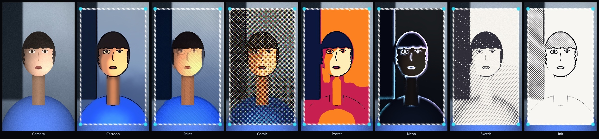
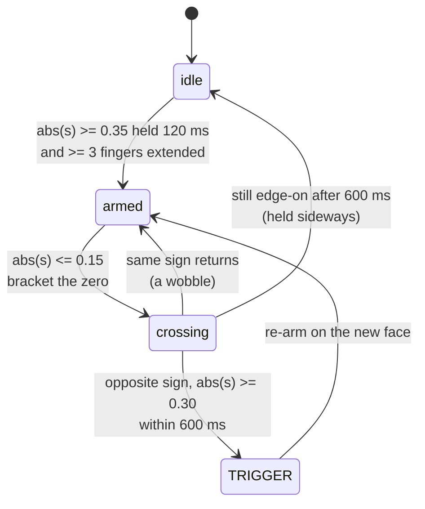
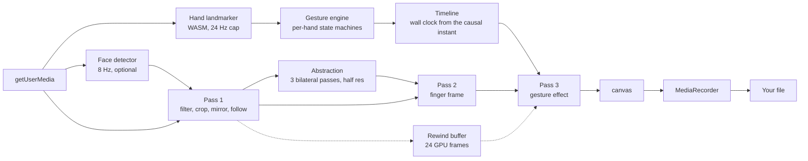
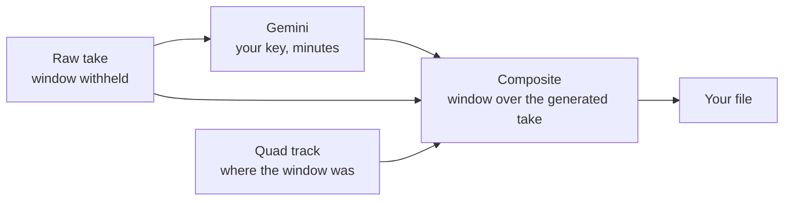

<div align="center">

<a href="https://amey-thakur.github.io/GESTURE-FX/"></a>

# Gesture FX

**Frame a shot with your hands. The picture inside becomes a cartoon.**

Hand gestures detected on the frame they occur, composited into the video as it records.
Entirely in the browser.

**[Open GESTURE-FX](https://amey-thakur.github.io/GESTURE-FX/)** · **[The method](docs/GESTURES.md)** · **[Specification](docs/SPECIFICATION.md)**


<a href="https://github.com/Amey-Thakur"></a>

<br><br>

[](https://amey-thakur.github.io/GESTURE-FX/)

<em>Rendered by the application, from a synthetic subject.</em>

</div>

<br>
<br>
<br>

## The finger frame

Hold both index fingers up and both thumbs across.

The rectangle between your hands becomes a window. Inside it the scene is redrawn in another medium; outside it the camera image continues untouched. Both are in the recording as pixels, on the frame they happened.

<div align="center">
<br>

<br>
<em>The camera frame, then the same frame in seven media. Every one a shader, every one at full frame rate.</em>
<br><br>
</div>

<br>

### Three representations, composed

The cartoon is not a posterise with an outline over it. It is an explicit decomposition, after the white-box formulation of cartoon representation, with each part computed analytically rather than learned.

| Representation | Carries | Computed as |
| --- | --- | --- |
| **Surface** | Flat interiors, sharp boundaries | Three passes of a bilateral filter, coarse to fine, at half resolution |
| **Structure** | Cel colour | Luminance quantisation with a hyperbolic tangent edge, hue preserved |
| **Texture** | Contours | A difference of two Gaussians of equal weight |

<br>

Four decisions carry the result.

**One pass of smoothing is not enough.** A single edge-preserving filter removes grain. A sequence of them collapses each region onto its own colour and leaves the boundary where it was, and it is that flatness, not the outline, that makes the window read as drawn.

**The colour width is not the same on every pass.** A bilateral filter rejects any neighbour that differs by more than its range width, which is what protects a boundary and is also what makes a narrow filter keep heavy grain: in a dim room two adjacent pixels of one surface can differ by more than that width, and each grain is then defended as though it were an edge. The first pass is wide enough to average it away and the later passes narrow again.

**Tone is quantised in luminance, not per channel.** The colour is then scaled by the ratio of quantised to original. Rounding red, green and blue independently, which is what a posterise does, drags hues toward the corners of the colour cube and turns skin green.

**The line is a difference of Gaussians, not a gradient.** A Sobel response is proportional to local contrast, so it smears across a soft edge and speckles across a noisy flat one. Two Gaussians of equal weight cancel exactly over any region of constant brightness, whatever that brightness is, and change sign at a contour. One threshold then draws the same weight of line on a dark coat and on a lit face.

<br>

> [!IMPORTANT]
> **What a shader can and cannot do.** The published finger-frame apps that restyle the interior send video to a hosted generative model, metered and behind a key.
>
> A generative model **replaces** the subject, which is how it turns a person into an animated character. A shader **restyles** the subject that is there. No shader synthesises information the frame never carried. This one runs on device, in real time, with no key, and this README says which of the two it is.

<br>

### Where this decomposition comes from

The three-way split is not this project's. It is the white-box formulation of
cartoon representation, and I have a published paper that extends it with a
generative adversarial network trained to produce each representation and to
recombine them.

| | **[White-Box Cartoonization](https://github.com/Amey-Thakur/WHITE-BOX-CARTOONIZATION)** | **This window** |
| --- | --- | --- |
| Representations | Learned | Written in closed form |
| Runs on | A GPU, offline, over a file | A fragment program, at frame rate, in a tab |
| Needs | A trained model and weights to ship | Nothing beyond the shader |
| Produces | The better cartoon | The cartoon that arrives in 6 ms |

The two are answers to different questions, and the comparison is worth stating
plainly rather than implying a winner. A network learns what a cel-painted
surface looks like, which no closed form recovers. A closed form costs one pass
over the pixels and holds a phone at 24 Hz, which no network of that quality
does. The window needs the second, because the effect has to be in the frame
being recorded and not in a file produced afterwards.

> [!NOTE]
> **Prior work, named.** *White-Box Cartoonization Using an Extended GAN
> Framework*, Amey Thakur, Mega Satish and Hasan Rizvi, IJEAST 5(12), 2021.
> [DOI](https://doi.org/10.33564/IJEAST.2021.v05i12.049) ·
> [Repository](https://github.com/Amey-Thakur/WHITE-BOX-CARTOONIZATION) ·
> [Preprint](https://arxiv.org/abs/2107.04551)
>
> What is new here is the analytic construction of each representation and the
> derivation of the three constants that govern them, which
> [the paper](paper/) sets out in full.

<br>

### Holding the window still

Fingertip landmarks move by a percent of the frame while the hands do not, and a window whose edges shimmer is unusable whatever is inside it.

| Problem | Handling |
| --- | --- |
| Jitter while the hands are still | Velocity-adaptive smoothing, after [Casiez et al.](https://doi.org/10.1145/2207676.2208639), rescaled to the elapsed interval so it behaves identically at 24 Hz and at 60 Hz |
| A hand rotating toward the lens foreshortens across a threshold | Hysteresis on both the finger separation and the area gate |
| Occlusion produces one wildly wrong update | A jump beyond a third of the frame is rejected until it persists |
| Tracking drops for a few ticks mid-hold | The window is held for 240 ms before it begins to close |
| The hands cross | Even-odd coverage, so the quad folds into the two lobes it actually describes |

Corners are kept in **anatomical order**, so a corner is the same fingertip for the life of the frame and smoothing needs no correspondence search. Because that ordering is stateless, a crossed quad uncrosses by itself.

<br>
<br>
<br>

## Or let a model draw it

The seven styles above are shaders. A shader restyles what is in front of it and
cannot invent what is not, which is the honest limit stated above.

If you want the other thing, the application will do that too, with **your own
Gemini key**. Hosting stays free, because the key is yours and the request is
made from your browser.

<br>

| Step | What happens |
| --- | --- |
| **Arm** | The control beside the record button switches the take to raw. The window becomes an outline drawn over the viewfinder rather than into the canvas |
| **Record** | The take is the clean camera image. Where the window was, at every instant, is recorded alongside it |
| **Generate** | The take goes to Google's video editing model with a style prompt, and comes back redrawn |
| **Composite** | The take is replayed with the generated version showing through the window the hands drew |

<br>

Three details are the whole of why it works.

**The take is recorded clean.** Anything the shader draws is in the recording,
because the canvas the shader draws on is the canvas the recorder captures. A
window baked into the pixels would be redrawn along with everything else, so in
this mode the outline moves out of the canvas and into the document, where the
recorder cannot see it.

**The geometry is kept, not recovered.** The corners are only known while the
hands are being tracked, and by the time the generated clip arrives the hands
are long gone. Re-running the tracker over the finished recording would cost a
second pass of inference and could disagree with what the user actually saw.

**Every prompt carries the same constraint.** A generative video model reframes
by default, because reframing usually improves the shot it was asked for. Here
it would be fatal: the window is positioned from the original footage, so a
model that zooms or recentres puts the generated world beside the frame instead
of inside it. The style half of the prompt is yours; the alignment half is not
editable.

> [!CAUTION]
> **This is the one part of the application that is not local, and it is off
> until you switch it on.** The recording is uploaded to Google, the generation
> is billed to your key, and it takes minutes rather than seconds. Nothing is
> sent until you press Generate.
>
> The key is held in the tab and written to the device only if you ask. It is
> never in this repository, a log, or a URL: it travels in a request header.
> The model's output is offered for download as soon as it exists, so a failure
> in the compositing step cannot lose a generation you have paid for.

The approach of restyling the whole frame and revealing it through the tracked
window, rather than asking a model to respect a boundary that moves every frame,
follows the published finger-frame video app. The implementation here is this
project's own.

## The instant, not the interval

Gesture recognition is usually posed as classification: label each frame, act on the label.

That suffices for **control**, where a few frames of latency go unnoticed. It fails for **synchronisation**, where the output must align to the frame on which the gesture physically occurred.

> Identify the exact frame on which a hand movement occurs, composite an effect from that frame, and encode the result. On the client. At interactive rates.

<br>

Three landmarks span the palm: the wrist $P_0$, the index knuckle $P_5$, the little finger knuckle $P_{17}$. Take the normalised two-dimensional cross product of the two palm edges.

$$
s = \frac{(P_5 - P_0) \times (P_{17} - P_0)}{\|P_5 - P_0\| \cdot \|P_{17} - P_0\|}
$$

This is the sine of the angle between those edges **as projected onto the image**, signed by the winding order of the triangle they span.

<div align="center">
<br>

<br>
<em>Computed, not illustrated. Each value of s is what the detector reads at that rotation.</em>
<br><br>
</div>

Rotate the hand about its long axis by $\theta$. Writing the un-rotated edges as $v_1 = (a, b)$ and $v_2 = (c, d)$, orthographic projection scales only the $x$ component:

$$
s(\theta) = k(\theta) \cdot \cos\theta
\qquad \text{where} \qquad
k(\theta) = \frac{ad - bc}{\|v_1(\theta)\| \cdot \|v_2(\theta)\|}
$$

The numerator $ad - bc$ is fixed by the anatomy of the palm and is positive. Both norms are positive. So $k(\theta) > 0$ for every $\theta$, which gives the two facts the detector rests on:

$$
\mathrm{sign}\,s(\theta) = \mathrm{sign}\,\cos\theta
\qquad \text{and} \qquad
s(\theta) = 0 \quad \text{exactly when} \quad \theta = \frac{\pi}{2}
$$

> [!IMPORTANT]
> **A palm flip is a zero crossing of one scalar, and the crossing is the exact frame of the flip.** An instant, not an interval.

The magnitude is *proportional* to $\cos\theta$, not equal to it: $k$ drifts as the projected edges shorten. The sign and the zero are exact regardless, and only those are load bearing.

<div align="center">
<br>

<br>
<em>The scalar the detector reads, beside the frame it reads it from.</em>
<br><br>
</div>

<br>

### Measured, not asserted

Against 360 generated sequences in which the crossing time is known exactly:

| Measure | Result |
| --- | --- |
| **Flips detected** | 95.0% |
| **False positives** | 0 in 240 near-miss sequences |
| **Mean localisation error** | 6.7 ms, a sixth of the interval between two tracking frames |
| **Median** | 4.0 ms, a tenth of that interval |

The zero lies between samples, so it is interpolated between the two that bracket it. That alone took the mean error from 33.4 ms to 6.7 ms and removed a 30 ms bias. **A detector that treats a gesture as the zero of a continuous quantity can report it more finely than it samples**, which a per-frame label cannot.

The corpus is generated rather than filmed, because the crossing frame is not observable in video to a precision finer than the error being measured. The figures therefore bound the detector's own error and exclude the landmark estimator's.

> [!TIP]
> **[Run the evaluation yourself](https://amey-thakur.github.io/GESTURE-FX/evaluation.html).** It runs the shipped detector against a seeded corpus in your browser and prints the table above. Nothing here has to be taken on trust.

<br>

| | **Two-pose classifier** | **Zero crossing** |
| --- | --- | --- |
| Needs confidence | Through the blurred middle, where it is lowest | Only before and after it, where landmarks are good |
| Yields | An interval | An instant |
| Training data | Required | None |
| Cost per frame | A model | One subtraction, one cross product, one division |

<br>

Three invariances follow at no cost.

| Property | Why it holds |
| --- | --- |
| **Mirror** | A selfie preview negates $s$ everywhere. A crossing of a negated signal is still a crossing, at the same instant |
| **Scale** | $s \in [-1, 1]$ is a ratio. Hand size and lens distance cancel, so no calibration step exists in this project |
| **Handedness** | Left and right differ in the sign they start from, not in whether a crossing occurs |

<br>
<br>
<br>

## Rejecting what is not a flip

A crossing alone would fire on any hand that turns. Four conditions gate it.



| Condition | Rejects |
| --- | --- |
| Steady palm held 120 ms | A hand entering frame already rotating |
| At least three fingers extended | A rotating fist, a conversational wrist turn |
| Crossing spans more than one sample | One frame of bad landmarks inverting the winding |
| Crossing completes within 600 ms | A hand held edge-on, as when pointing |
| Opposite face reached and settles | A wobble toward edge-on and back |

> [!TIP]
> The rule governing every threshold: **a missed gesture costs one retry, a spurious gesture ruins the take.** Every default is biased toward missing.

<br>
<br>
<br>

## Recording without touching anything

The gesture this is built around occupies both hands. Two features exist because of that, and only because of that.

<br>

### Say it

Voice control starts and stops a take, and changes the frame style, so both hands stay in shot.

| Say | Result |
| --- | --- |
| “record”, “action”, “rolling” | Start a take |
| “stop”, “cut”, “finish”, “wrap” | End it |
| “cartoon”, “paint”, “comic”, “poster”, “neon”, “sketch”, “ink” | Change the medium in the window |
| “anime”, “oil”, “halftone”, “pencil”, “glow”, “pen and ink” | The same seven, under the name that comes to mind |

> [!CAUTION]
> **This is the one feature that is not local.** Chrome and Edge implement the Web Speech API by sending microphone audio to the browser vendor's own service. Safari recognises on the device. No page can change that or observe it.
>
> It is therefore **off until you switch it on**, the settings panel names which of the two cases your browser is in, and an indicator sits over the viewfinder for as long as it is listening.

<br>

### Stay in the middle of it

A phone propped against something while both hands are busy is not pointed accurately. Auto-framing follows the face by sliding the crop, which is free: the output frame is already a crop of a wider sensor.

| Decision | Reason |
| --- | --- |
| The crop is tightened by an eighth first | A portrait output from a landscape camera has horizontal room and no vertical room at all. Tightening buys both axes somewhere to go |
| The face sits at two fifths of the height | A head centred exactly leaves a band of empty space above it and cuts the shoulders |
| Motion under 3.5% of the frame is not followed | Detection jitters while the subject sits still, and a crop that answers each of those is unwatchable |
| Motion above it is followed less the dead zone | The framing crosses the boundary continuously rather than snapping the moment it is exceeded |
| The last framing is held for 1.2 s after the face is lost | A subject who turns away does not send the picture gliding back to the middle and out again |

Detection runs at 8 Hz on a 230 KB model, downloaded only when the setting is on, and never at all when it is off.

<br>
<br>
<br>

## Architecture



The restyle path is the same pipeline run twice, with the window withheld the
first time:



Three decisions carry the design.

**The recorder captures the canvas, not the camera.** The effect is in the exported file as pixels. No second pass, nothing to keep in sync, no editing step.

**Detection is decoupled from rendering.** Inference is capped at 24 Hz; the canvas draws at display rate. A trigger carries the timestamp of the **causal instant**, not of confirmation, and the effect plays from it on wall-clock time, backdated at most 120 ms.

**The abstraction runs only while the window is open.** A session that never makes the gesture never allocates its buffers or pays for its passes.

> [!NOTE]
> On a device tracking at 15 Hz a gesture is *recognised* later, but the effect is **exactly as smooth** as at 60 Hz. Nothing about playback is tied to inference.

<br>
<br>
<br>

## Rewind cut

Substituting the subject needs information absent from the stream. Its recent past is not absent.

Three seconds are held on the GPU: quarter resolution, eight captures per second, about 5.5 MB. On the trigger the effect cuts to a moment when you stood elsewhere, holds, and cuts back, inside one continuous take.

<div align="center">
<br>

<br>
<em>Measured. The subject states the second it was drawn: live 4.3s, recalled 2.5 / 2.8 / 2.9s, live again 5.6s.</em>
<br><br>
</div>

Seams are hard cuts with a tear. A dissolve between two moments of one scene reads as a fault; a cut reads as an edit, which is what it is.

<br>
<br>
<br>

## Gestures and effects

Two independent registries. **Any gesture fires any effect**, selected on its row.

| Gesture | Detected by | Default effect |
| --- | --- | --- |
| **Palm flip** | Zero crossing of the projected winding | Glitch |
| **Swipe** | Horizontal travel in hand spans over 260 ms | Whip pan |
| **Fist** | All fingers curled, held 260 ms | Freeze frame |
| **Palm push** | Apparent span grows 25% in 300 ms | Flash |
| **Two fingers** | Index and middle extended and separated, palm squarely presented, held 420 ms | Chromatic split |

<div align="center">
<br>

<br><br>
</div>

Six filters run underneath as a persistent look. Filters are pass one, effects the last pass, so **42 combinations exist from 13 shaders**.

> [!WARNING]
> Palm push requires the hand to *grow*, not merely to be open. An open palm is also the pose a flip starts from, so a pose-only test would fire a flash before every flip. The two are separated by intent, not by shape.
>
> Two fingers additionally requires the palm to be squarely presented. Projection compresses lateral displacement, so a half-flipped open palm foreshortens the ring and little fingers and projects to a V.

<br>
<br>
<br>

## What is different

| Claim | Substance |
| --- | --- |
| **Derived, not tuned** | A proof, three invariances, a falsifiable claim. Not thresholds found by trial |
| **Effects in the recording** | Not in a preview. No surveyed implementation does this |
| **Framing is free** | The published finger-frame apps that restyle the interior route video to a paid API. This one is a shader, on device, in real time |
| **Cuts to the past** | Nothing else in this category retains frames |
| **Honest about the network** | The one feature that is not local says so in the interface, in the settings, and here |
| **Defects handled, not noted** | Safari's `stop` that never fires, capture streams with no frames, containers with no duration, a render loop starved by an occluded window |
| **One dependency** | 25 KB of JavaScript, gzipped |

<br>
<br>
<br>

## Privacy

No server. No analytics, telemetry, error reporting, font network or cookie. Both typefaces are vendored, so no third party learns you opened the page.

**Two checks settle it.**

1. Open the network panel. After the initial load, nothing is requested.
2. Load once, then disconnect. It still tracks, renders, records and exports.

Recordings live in page memory and die with the tab.

**Two features are exceptions, and both are off until you switch them on.** Voice
control sends microphone audio to your browser vendor's speech service in Chrome
and Edge. The restyle uploads one recording to Google against your own key. Each
says so where it is switched on, each shows an indicator while it is active, and
[PRIVACY.md](docs/PRIVACY.md) accounts for both.

> [!CAUTION]
> A canvas capture stream emits frames only when the canvas is **painted**, and browsers stop painting windows they consider hidden. **Keep the tab in front while recording.** If it is not, the take is abandoned within 2.5 seconds and you are told why, rather than failing silently.

<br>
<br>
<br>

## Performance

| Class | Tracking | Render | Verified |
| --- | --- | --- | --- |
| Desktop GPU | 24 Hz, the cap | 60 fps | Yes |
| Recent phone or tablet | 20 to 24 Hz | 50 to 60 fps | Estimated |
| Older device | 12 to 18 Hz | 30 to 45 fps | Estimated |

The last row degrades in **recognition latency**, not effect quality.

A live frame rate sits beside the gesture list. It is worth more than this table.

> [!WARNING]
> **iOS recording is unverified.** The APIs are supported and four known Safari defects are mitigated in code, but nothing has been confirmed on an Apple device. [BROWSER-SUPPORT.md](docs/BROWSER-SUPPORT.md) separates tested from expected. An iPhone report is the most useful contribution available.

<br>
<br>
<br>

## Run it

```bash
git clone https://github.com/Amey-Thakur/GESTURE-FX.git
cd GESTURE-FX
npm install
npm run dev
```

> [!WARNING]
> `getUserMedia` requires a secure context. `http://localhost` qualifies; `http://192.168.1.10:5173` does not. That is why a page working on a laptop fails on the phone pointed at it.

The 11.8 MB runtime and 7.8 MB model load from public CDNs. To serve them from one origin, and work offline from the first visit:

```bash
npm run vendor:models
```

<br>
<br>
<br>

## Extend it

One file and one line, by construction.

| To add | Write | Then |
| --- | --- | --- |
| A gesture | One file in `scripts/gestures/detectors/` against `GestureDetector` | List it in `detectors/index.ts` |
| An effect | One fragment shader in `scripts/effects/` | List it in `registry.ts` |
| A filter | One fragment shader in `scripts/effects/filters.ts` | List it in `FILTERS` |
| A frame style | One `styleLook` function in `scripts/effects/portal-styles.ts` | List it in `PORTAL_STYLES` |
| A restyle look | One entry in `scripts/ai/styles.ts` | The alignment constraint is appended for you |

[GESTURES.md](docs/GESTURES.md) and [EFFECTS.md](docs/EFFECTS.md) carry worked examples.

> [!TIP]
> The highest value contribution available is **recorded landmark fixtures and detector tests**: capture sequences for a gesture and for the near misses that must not fire, then run detectors against them in CI. It turns threshold tuning from judgement into measurement.

<br>
<br>
<br>

## Built with

TypeScript, no framework, one runtime dependency. WebGL 2. The browser's own encoder. Vite builds it and reaches nothing. Actions type-checks, builds and deploys on every push.

| Document | Covers |
| --- | --- |
| [SPECIFICATION.md](docs/SPECIFICATION.md) | Feasibility, architecture, frame budget, limitations |
| [GESTURES.md](docs/GESTURES.md) | Full derivation, every state machine, the hard cases |
| [EFFECTS.md](docs/EFFECTS.md) | Render pipeline, uniform set, shader cost |
| [BROWSER-SUPPORT.md](docs/BROWSER-SUPPORT.md) | Tested against expected, four defects handled |
| [PRIVACY.md](docs/PRIVACY.md) · [SECURITY.md](.github/SECURITY.md) | What is processed, and a threat model with no backend |

<br>
<br>
<br>

## Author


**[Amey Thakur](https://github.com/Amey-Thakur)** · I wanted to know whether a browser could catch a gesture on the exact frame it happens. The answer was a cross product. What still does not work is written down.

<br clear="left">

[GitHub](https://github.com/Amey-Thakur) · [LinkedIn](https://www.linkedin.com/in/amey-thakur) · [ORCID](https://orcid.org/0000-0001-5644-1575)

<br>

## License

[MIT](LICENSE). MediaPipe and its models are Apache-2.0, by Google. Outfit and Inter are OFL and vendored here. Citation metadata: [CITATION.cff](CITATION.cff), [codemeta.json](codemeta.json).
